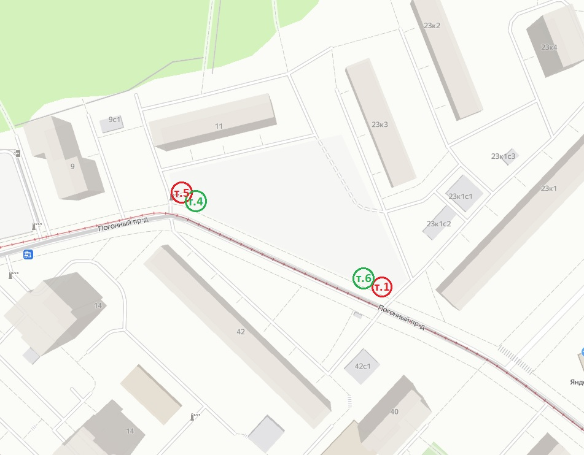
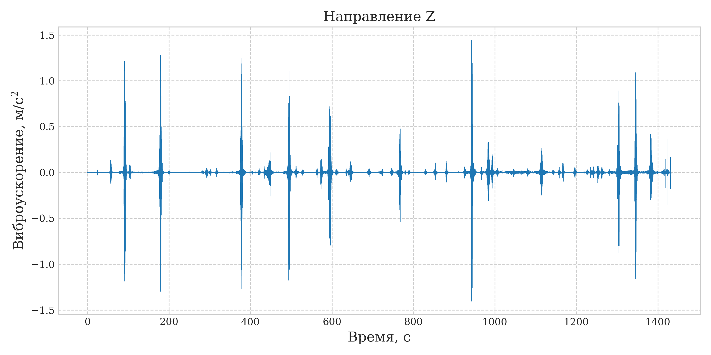
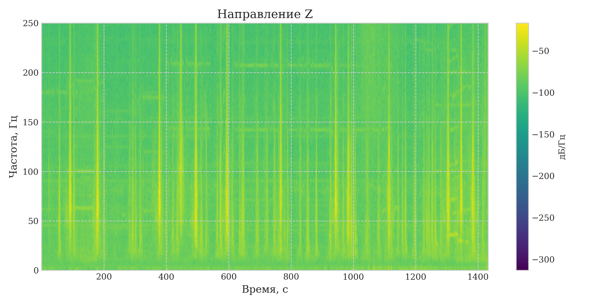
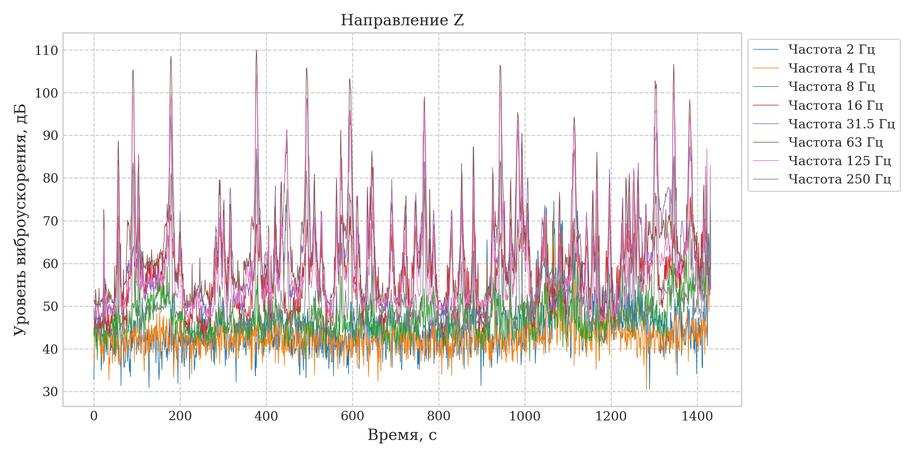
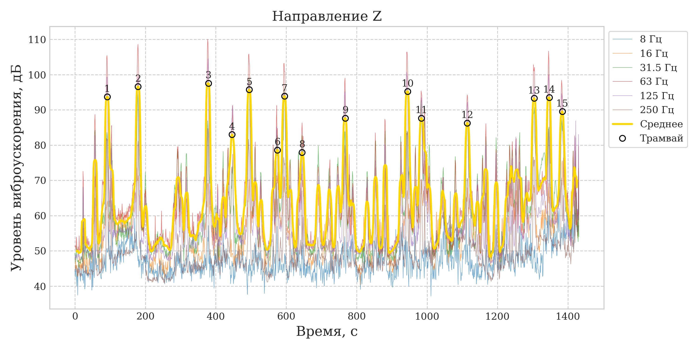
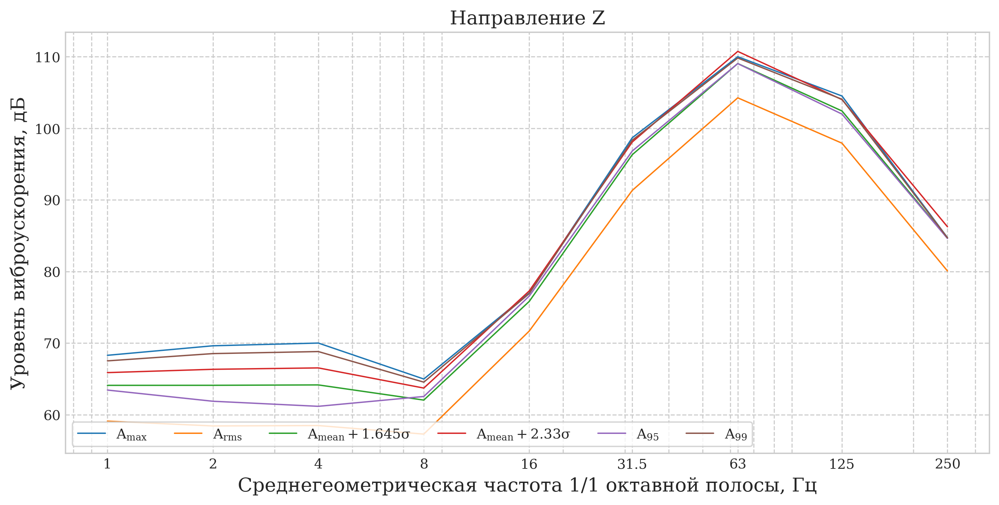
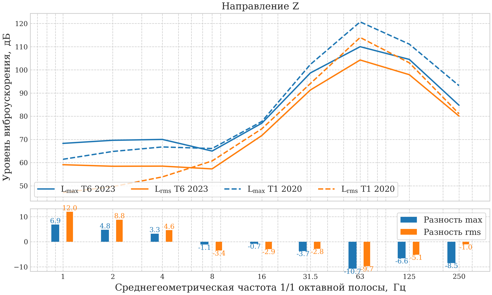
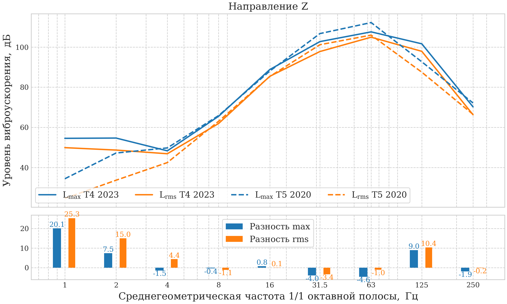

# Tram-Induced Ground Vibration — Measurement & Analysis

> A reproducible signal-processing pipeline that turns raw accelerometer
> recordings into octave-band vibration metrics, automatically detects
> individual tram passages, and quantifies how **track reconstruction
> changed the vibration that reaches nearby buildings** — backed by a
> peer-reviewed publication and a conference talk.

<p align="left">
  <a href="https://doi.org/10.22337/2077-9038-2023-4-159-165">
    </a>
  
  <a href="https://github.com/pokormi-kota/vibe">
    </a>
  
</p>

---

## TL;DR

Trams running through dense city neighbourhoods inject vibration and structural
noise into the ground and into the buildings around them. A worn track can add
**up to +10 dB** to that vibration (per Russian design code SP 441.1325800.2019).
This project measures, in the field, what actually happens to that vibration when
a track is **reconstructed** — comparing the *same* street section **before
(2020)** and **after (2023)** the rebuild, on both a **straight** and a **curved**
segment.

The analysis takes ~1500 Hz tri-axial accelerometer recordings (and legacy
pre-processed octave-band data), and for each measurement point it:

1. band-pass filters the raw signal to the standardised vibration range,
2. computes spectrograms and **1/1-octave-band** acceleration levels,
3. **detects every individual tram passage** as a peak in a weighted energy sum,
4. derives per-event statistics (max, RMS, percentiles `L95`/`L99`),
5. compares the before/after spectra band-by-band and exports formatted reports.

The headline finding: reconstruction did **not** uniformly reduce vibration — it
**redistributed** it across frequency. The vertical level dropped by up to
**11–13 dB** in the 8–63 Hz range on the straight section, while several other
bands *rose* by tens of dB. This shows the single fixed "+10 dB worn-track"
correction in the design code is really **frequency-dependent**, and that the
*quality* of the repair matters as much as the fact that it happened.

> **Note for reviewers / recruiters:** the result figures keep their original
> Russian axis labels (as published). Every figure below has an English caption
> and a short glossary is provided at the [bottom](#figure-glossary).

---

## Why this matters

- **Public health & comfort.** Tram vibration and re-radiated structural noise in
  nearby homes routinely exceed sanitary limits set by Russian federal law
  (No. 52-FZ, No. 384-FZ). Chronic exposure is linked to sleep disturbance and
  stress; for buildings it means crack growth and resonance.
- **Trams are under-studied vs. railways.** Tram tracks run alongside roads, in
  dense historic districts, with poorly characterised ground and buried
  utilities — so the "free-field" assumptions used for railways don't hold.
- **A real engineering decision.** Cities spend heavily on track reconstruction.
  This work asks a concrete question: *did the rebuild actually lower the
  vibration that residents feel, and by how much, at which frequencies?*

---

## The study at a glance

| | |
|---|---|
| **Location** | Pogonny proezd, Moscow — tram route *Bulvar Rokossovskogo → Bogorodskoye* |
| **Campaigns** | 2020 (before reconstruction) vs. 2023 (after the 2020–2022 rebuild) |
| **Sections** | Straight (points **1** ↔ **6**) and curved (points **5** ↔ **4**) |
| **Axes** | `Z` vertical, `X` across the track, `Y` along the track |
| **Events captured** | 2020: 18 + 21 tram passages · 2023: 15 + 13 passages |
| **Instruments** | Low-noise velocimeters / accelerometers (ZetLab, Ecofizika), `fs ≈ 1500 Hz` |
| **Standards** | SP 441.1325800.2019 (vibration prediction), GOST band-pass, 1/1-octave bands 1–250 Hz |



*Measurement layout on Pogonny proezd. **Red** markers = 2020 campaign, **green** =
2023. Points 1/6 sit on the straight section; points 4/5 on the curve. The same
physical spots were re-measured after the track was rebuilt.*

---

## The analysis pipeline

Each stage below is a real output of the notebook
([`Trams_trains_vibration.ipynb`](Trams_trains_vibration.ipynb)), driven by the
custom [`vibe`](#the-vibe-library) library.

### 1. Raw acceleration signal

Tri-axial ground acceleration (m/s²) is read from the instrument's native CSV,
trimmed of start/stop transients, and noisy segments are cut.



*Vertical acceleration over a ~24-minute window. Each burst is one tram passing
the sensor — already visible by eye, and later detected automatically.*

### 2. Spectrogram

A short-time Fourier transform shows where the energy lives in time **and**
frequency, confirming that tram events concentrate below ~250 Hz.



*STFT of the band-pass-filtered signal (Butterworth, 1–315 Hz). Vertical streaks
are tram passages; the colour scale is spectral power density.*

### 3. Octave-band level–time history

The signal is converted to standardised **1/1-octave-band** acceleration levels
(dB), the form vibration limits are actually specified in.



*Per-band acceleration level vs. time. The 63 / 125 Hz bands dominate during
passages — consistent with rail/wheel roughness excitation.*

### 4. Individual tram detection

Trains are isolated **semi-automatically**: a user-weighted sum of the most
informative bands forms an "energy" envelope, and `scipy.signal.find_peaks`
locates each passage. The weighting is a detection aid only (no physical meaning),
which keeps the method transparent and tunable per site.



*Numbered circles mark the 15 detected tram passages at this point. The thick
yellow curve is the weighted-energy envelope used for peak picking.*

### 5. Per-event statistics

For every passage and every band, the pipeline computes max and RMS levels, then
aggregates them into engineering statistics: mean, mean + 1.645σ / 2.33σ, and the
`L95` / `L99` percentiles used in vibration assessment.



*Statistical spectra across all passages — the basis for comparing campaigns and
checking against normative limits.*

### 6. Before/after comparison

The core deliverable: 2023 vs. 2020 spectra overlaid, with the band-by-band
**difference** below.



*Straight section, vertical axis. Solid = 2023 (after), dashed = 2020 (before);
blue = `Lmax`, orange = `Lrms`. The lower panel is the difference per band.
Reconstruction **cut** the 8–63 Hz levels (incl. the 16 Hz parametric-resonance
band) but **raised** the 125–250 Hz bands.*



*Curved section, vertical axis. Here the picture is mixed — limited change in
8–63 Hz, with increases up to ~22–25 dB elsewhere — underlining that the outcome
depends on workmanship and geometry, not just on "new track."*

---

## Key findings

- **Reconstruction redistributes vibration, it doesn't simply remove it.** On the
  straight section the vertical level fell by up to **11 dB (max) / 13.2 dB (RMS)**
  in the 8–63 Hz range, but several higher bands rose — by up to **33 dB** in the
  horizontal direction.
- **The 16 Hz band saw the largest drop** — that band carries the parametric
  resonance of the track for tram speeds of 25–50 km/h, so it's the most sensitive
  to track condition.
- **The design-code correction should be frequency-dependent.** SP 441's single
  "+10 dB for worn track" lumps all frequencies together; the field data argue for
  per-band coefficients (the code's Table 5.1) calibrated specifically for trams.
- **Repair quality is a first-class variable.** A rebuild done to a higher standard
  can lower vibration; a poorer one can raise it. Either way it must be *measured*,
  not assumed.

---

## Skills demonstrated

This repository is meant as a portfolio piece. Concretely it shows:

| Area | What's in here |
|---|---|
| **Digital signal processing** | Butterworth band-pass design & zero-shift filtering (`scipy.signal.sosfilt`), STFT spectrograms, 1/1- and 1/3-octave-band synthesis |
| **Event detection** | Robust, tunable peak picking over a weighted multi-band energy envelope (`find_peaks`) to isolate individual vehicles in continuous data |
| **Statistics** | Max / RMS / percentile (`L95`, `L99`) and mean ± kσ spectra; before/after differencing |
| **Data engineering** | Reading heterogeneous instrument formats (ZetLab, SS-box, Ecofizika), handling `-Inf` gaps, multi-file stitching, unit conversions (m/s² ↔ dB) |
| **Scientific Python** | `numpy`, `pandas`, `scipy`, `matplotlib`, reproducible Jupyter workflow |
| **Visualization & reporting** | Publication-grade figures and **automated formatted Excel reports** (`XlsxWriter`) |
| **Software design** | Logic extracted into a reusable, separately-published library — [`vibe`](https://github.com/pokormi-kota/vibe) |
| **Domain knowledge** | Building acoustics & vibration, normative framework (SP 441, GOST, SP 98), occupational/environmental limits |
| **Communication** | Peer-reviewed journal article + conference presentation (see below) |

---

## The `vibe` library

All reusable logic lives in a standalone, MIT-licensed package I maintain
separately: **[github.com/pokormi-kota/vibe](https://github.com/pokormi-kota/vibe)**.

| Module | Responsibility |
|---|---|
| `read_signal` | Load & clean recordings from different instruments; trim edges / segments; `m/s² ↔ dB` |
| `calc` | Octave-band synthesis, per-train amplitude extraction, statistics |
| `pic` | Standardised plots (signals, bands, statistical spectra) |
| `report` | Formatted Excel exports of results and per-train reports |
| `PyOctaveBand` | Octave / fractional-octave band filtering |

Keeping the science in a notebook and the engine in a tested, versioned library
mirrors how I'd structure analysis code on a team.

---

## Repository structure

```
trams-vibration/
├── Trams_trains_vibration.ipynb   # the analysis notebook (entry point)
├── assets/                        # curated figures used in this README
├── Data_raw/
│   ├── 2020/                      # sample input: pre-processed 1/1-octave levels (dB)
│   ├── 2023/                      # raw signal CSVs — NOT committed (100+ MB each)
│   └── Схема.jpg                  # measurement-point map
├── Output/                        # generated figures & Excel reports (git-ignored)
├── Smirnov_159-165.pdf            # the published article (RU/EN)
├── Трамвайные пути.pptx           # conference presentation
├── requirements.txt
├── CITATION.cff
└── LICENSE
```

### Data formats

- **2020 (`Data_raw/2020/*.csv`)** — already-processed **1/1-octave-band
  acceleration levels in dB**, one row per second, three axes side-by-side;
  gaps between recordings appear as `-Inf`. Small enough to ship as **sample
  data** so the pipeline can be inspected without the large raw files.
- **2023 (`Data_raw/2023/*.csv`)** — **raw time-domain acceleration** (m/s²) at
  `fs = 1500 Hz` with a short instrument header. These files are 100–140 MB each
  (over GitHub's limit) and are therefore **git-ignored**; the notebook documents
  exactly how they are read.

---

## Reproducing the analysis

```bash
# 1. Python 3.12 environment
python -m venv .venv
.venv/Scripts/activate            # Windows ( source .venv/bin/activate on *nix )

# 2. Dependencies
pip install -r requirements.txt

# 3. The vibe engine (kept in its own repo)
pip install "git+https://github.com/pokormi-kota/vibe.git"
#   …or clone it next to this project and add it to PYTHONPATH

# 4. Run
jupyter lab Trams_trains_vibration.ipynb
```

The notebook runs end-to-end on the committed **2020 sample data**. To reproduce
the 2023 results, drop the raw signal CSVs into `Data_raw/2023/` (format described
above) and re-run the 2023 section.

---

## Publication & talk

- 📄 **Smirnov V.A., Chechulina L.M.** "Tramway Condition Impact on the Vibration
  Effect." *Academia. Architecture and Construction*, 2023, no. 4, pp. 159–165.
  DOI: [10.22337/2077-9038-2023-4-159-165](https://doi.org/10.22337/2077-9038-2023-4-159-165).
  Full text included: [`Smirnov_159-165.pdf`](Smirnov_159-165.pdf).
- 🎤 **Conference presentation:** [`Трамвайные пути.pptx`](Трамвайные%20пути.pptx)
  ("Tram tracks — condition impact on vibration").

---

## Citation

If this work is useful to you, please cite the article (machine-readable metadata
is in [`CITATION.cff`](CITATION.cff)):

```bibtex
@article{Smirnov2023Tramway,
  title   = {Tramway Condition Impact on the Vibration Effect},
  author  = {Smirnov, Vladimir A. and Chechulina, Liubov M.},
  journal = {Academia. Architecture and Construction},
  year    = {2023},
  number  = {4},
  pages   = {159--165},
  doi     = {10.22337/2077-9038-2023-4-159-165}
}
```

---

## Figure glossary

The published figures retain their Russian labels. Quick translation:

| Russian | English |
|---|---|
| Направление Z / X / Y | Direction Z (vertical) / X (across track) / Y (along track) |
| Время, с | Time, s |
| Виброускорение, м/с² | Acceleration, m/s² |
| Уровень виброускорения, дБ | Acceleration **level**, dB |
| Среднегеометрическая частота 1/1 октавной полосы, Гц | 1/1-octave-band centre frequency, Hz |
| Частота, Гц | Frequency, Hz |
| Трамвай / Среднее | Tram / Mean |
| Разность max / rms | Difference of max / rms |

---

## Author

**Liubov Chechulina** ([@pokormi-kota](https://github.com/pokormi-kota)) —
Research Institute of Building Physics (NIISF RAASN) & Moscow State University of
Civil Engineering (MGSU).
Building physics · vibration & acoustics · scientific Python.

## License

Code and documentation in this repository are released under the **MIT License**
(see [`LICENSE`](LICENSE)). The article PDF and presentation remain
© the respective authors / publisher and are included for reference.
